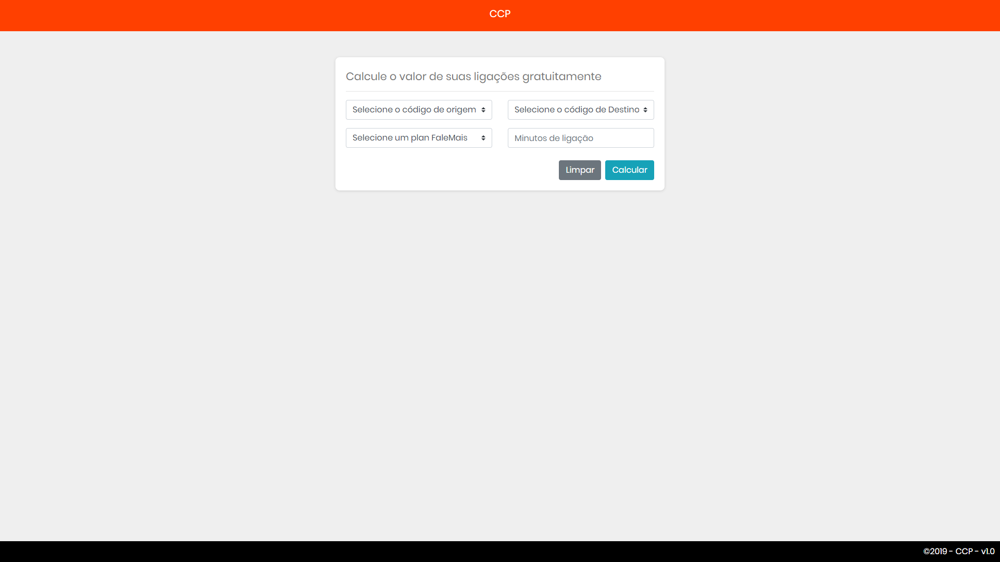
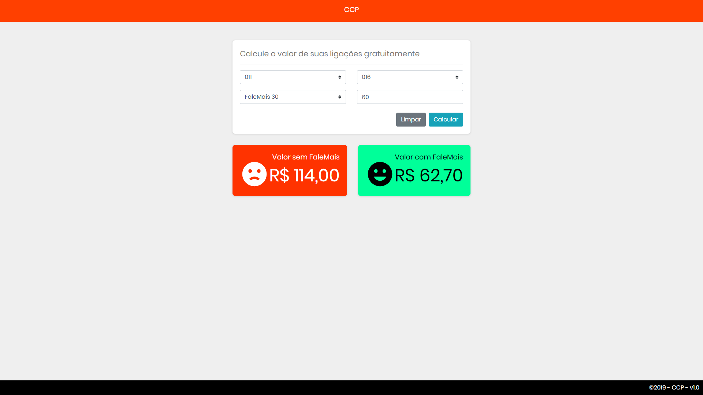

<h1 align="center">
 
Calc Call Price
</h1>

This project was created to solve a challenge requested by a company in the hiring process. It is a simple application that calculates call prices for a telephone operator.

  

  
  

## Features

- Calculate operator call.

## Getting started

- Clone project > enter the project folder
- run `yarn`
- run `yarn serve`

## License

This project is licensed under the MIT License - see the [LICENSE](https://opensource.org/licenses/MIT) page for details.

---

Created with passion by me 👨🏻‍💻
